# syhthems IoT Platform

syhthems 是一个开源的物联网平台项目，它可以实现物联网产品的管理，数据流的管理，设备的管理，设备数据的可视化查看等等这些基础的物联网平台功能，以及多用户和角色的权限管理，OAuth2 登录等功能。该项目目前用于本人学习 Spring Boot, Spring Security, Vue 以及 IoT，希望能和社区开发者共同学习和进步。

**文档：**[http://syhthems.ehaut.cn/](http://syhthems.ehaut.cn/)

**微服务架构改造** 目前正在进行 syhthems 微服务架构改造，详细进度可查看 project：[syhthems Platform 2.0](https://github.com/ehaut/syhthems-platform/projects/1) 

## 平台架构

syhthems IoT Platform 采用分模块开发，首先分为前端和后端两个大部分，前端比较简单，就只有一个 `syhthems-web` 模块，后端是主要的部分，分为 `syhthems-common` 平台基础模块，`syhthems-db` 数据访问模块，`syhthems-sso` 单点登录模块，`syhthems-web-api` Web 后台 API 模块，`syhthems-device`终端设备接入模块。

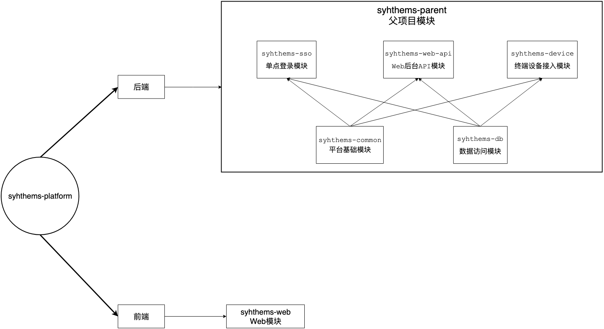

## 技术栈

### 后端

* Java
* Spring Boot
* Spring Security
* Spring OAuth2
* SSM
* MBG \(Mybatis Generator\)
* 通用 Mapper
* MySQL 数据库
* Redis 缓存

### 前端

* Node
* npm
* VueJS
* Vuetify
* Vuex
* Vue Router

### 终端设备

* NodeMCU Develop Kit v1.0
* SHT20
* Arduino

## 平台功能

* 终端设备能够从传感器读取感知到的原始数据信息。
* 终端设备能够将读取到的原始数据转化为正确的温湿度数据。
* 终端设备能够通过 WiFi 芯片连接后台系统。
* 终端设备能够将数据使用 HTTP 协议传送到后台系统。
* 后台系统能够实现用户的登录和注册。
* 后台系统能够实现多客户端的 OAuth2（第二代开放授权标准） SSO
  （Single sign-on，单点登录）以及 JWT（JSON Web Tokens）功能和登出
  功能。
* 后台系统能够实现用户的授权管理。
* 后台系统实现系统数据库表的增删查改功能。
* 后台系统能够实现方法级别的权限管理功能。
* 后台系统实现基本的 API 接口。
* 后台系统能够实现用户产品的创建和删除功能。
* 后台系统能够实现产品设备的管理功能。
* 后台系统能够实现设备数据流模板的管理。
* 后台系统能够接收终端设备发送过来的数据。
* 后台系统能够将设备发送的数据存储在关系型数据库或者时间序列数据
  库中。
* 后台系统能够对数据进行分时间查询。
* 前台能够实现单页面应用。
* 前台能够实现 OAuth2 SSO，能够从后台 SSO 系统获得 token 以及实现
  刷新令牌的功能。
* 前台能够实现页面的自适应布局。
* 前台能够实现导航菜单的动态获取和展示。
* 前台能够通过 AJAX（Asynchronous JavaScript and XML，异步的
  JavaScript 与 XML 技术）向后台 API 发送请求。
* 前台能够实现部分数据的全局共享。
* 前台使用 Material Design（材料设计）。
* 前台能够实现用户的登出功能。
* 前台能够实时校验用户的登陆状态。
* 前台能够实现产品的创建和删除，并将数据发送给后台系统。
* 前台能够实现产品下设备的创建和删除，并将数据发送给后台系统。
* 前台能够实现对数据流模板的创建和删除。
* 前台系统能够查看某个设备下的数据，并可以以图表的样式展示。
* 前台系统能够实现基本的错误处理。

## 平台预览

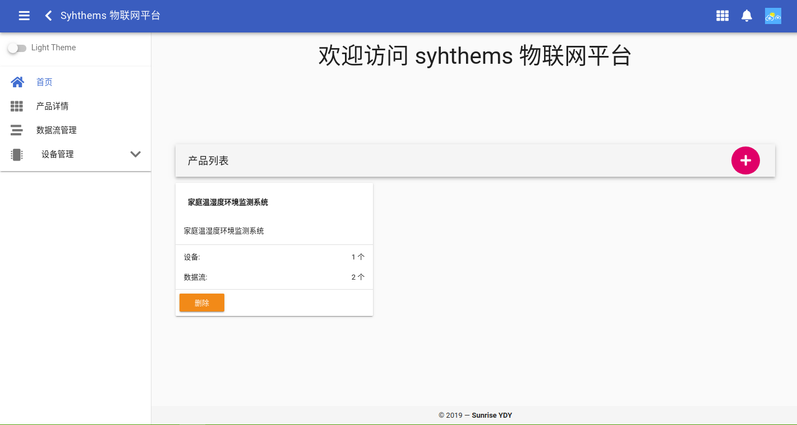

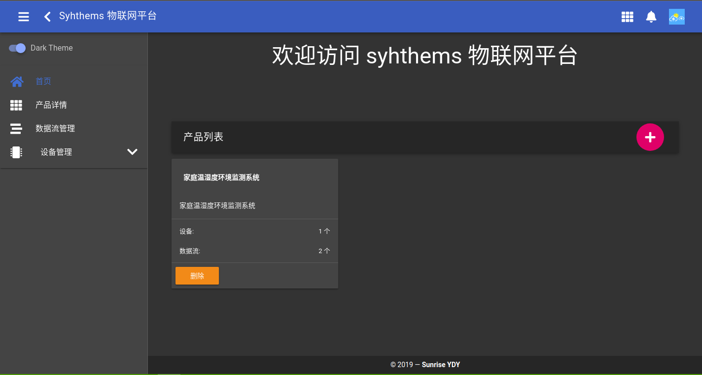

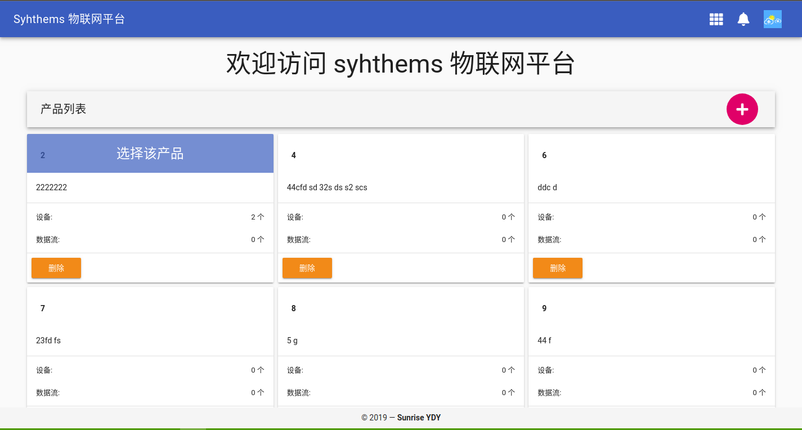

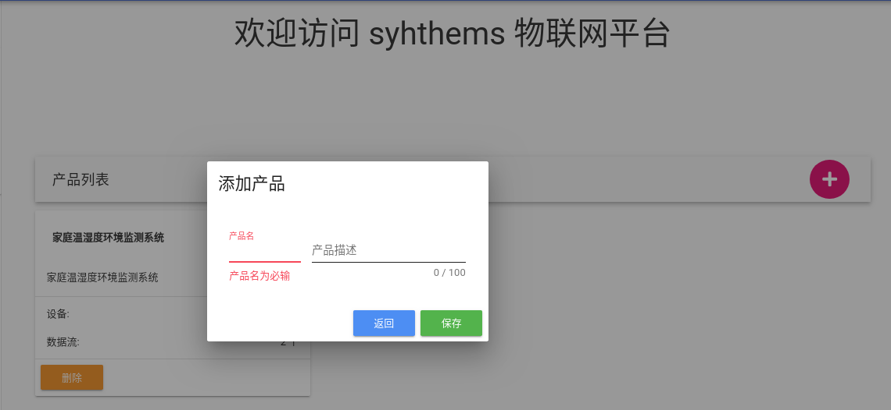

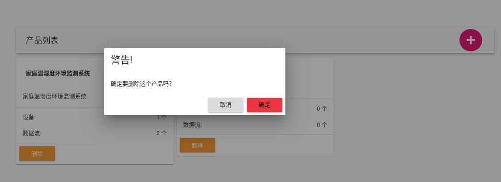

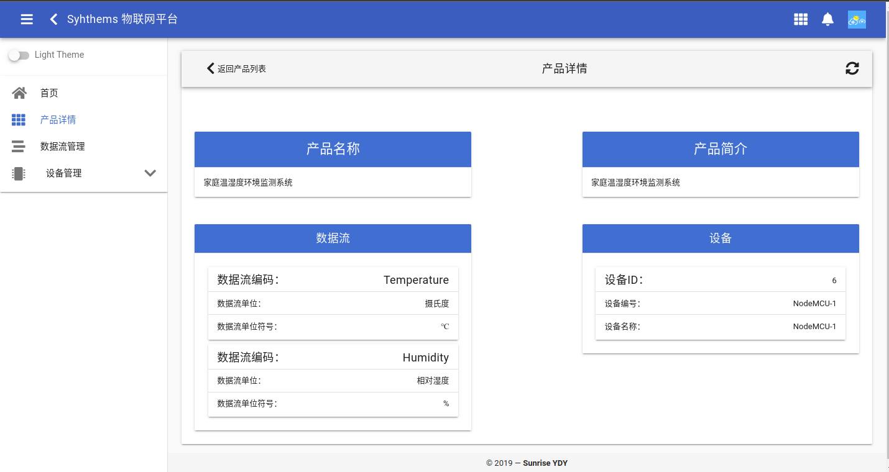

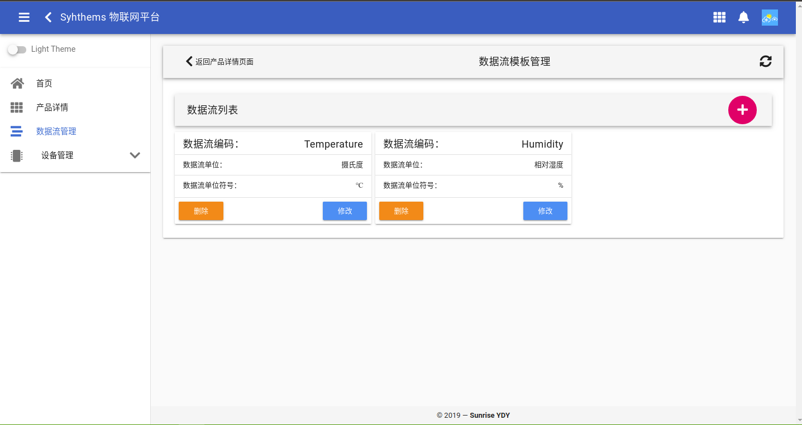

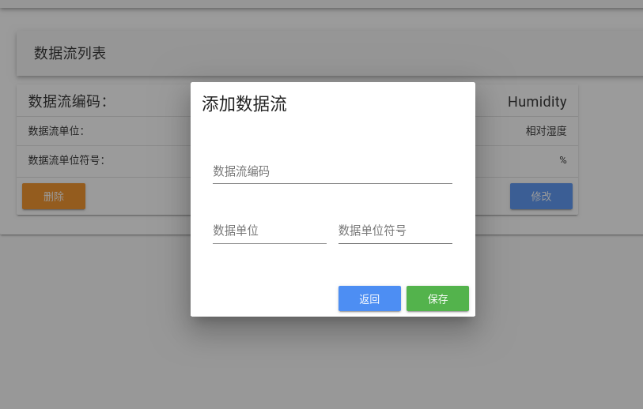

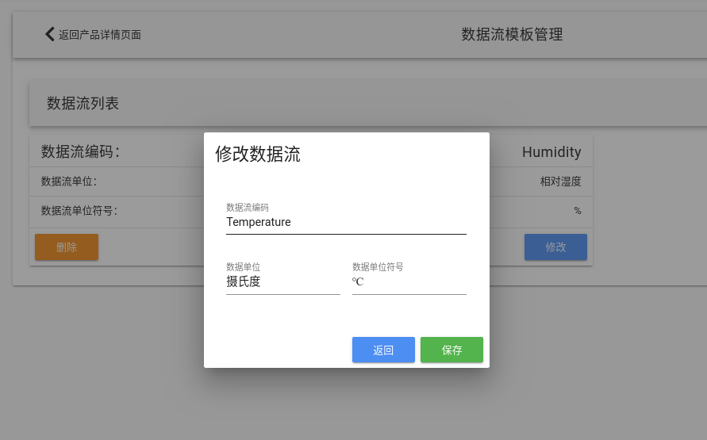

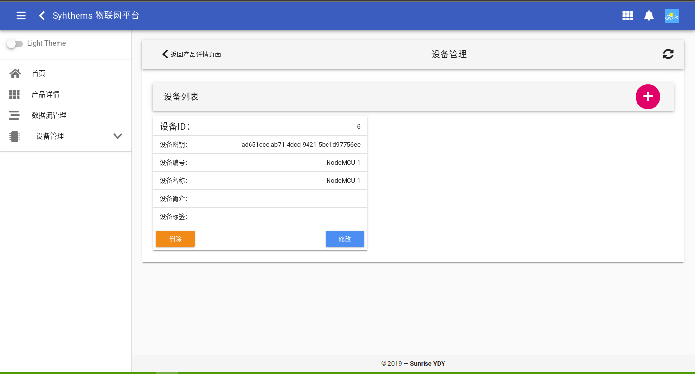

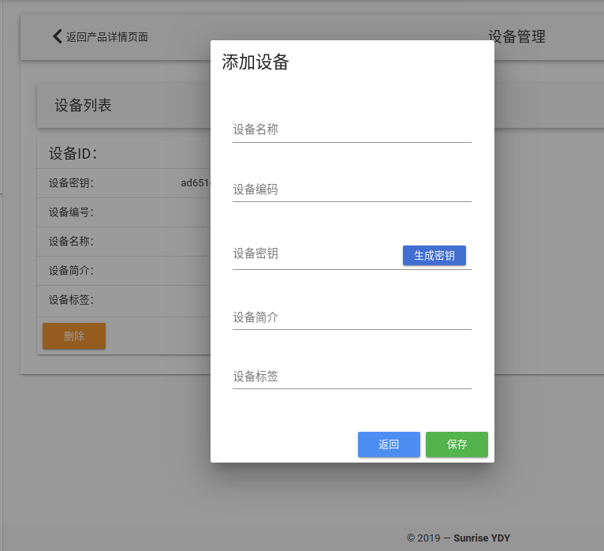

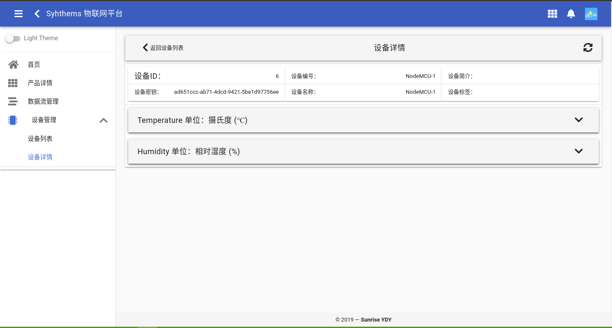

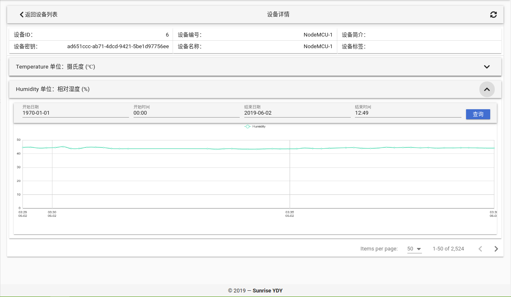

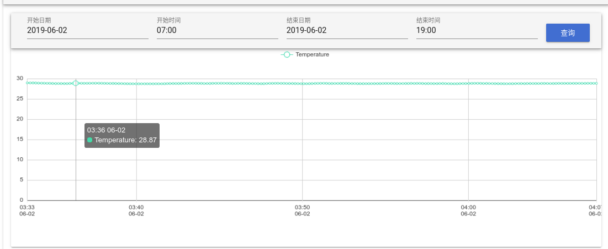

## 快速使用

### 开发及运行环境

* Java 8 或者 Java 11
* Maven
* NodeJS
* npm
* VueJS
* MySQL 5.7
* Redis

### 后台

1. 从 github 上克隆最新的代码

   ```bash
    git clone https://github.com/ehaut/syhthems-platform.git
    # 在国内可以使用阿里云的代码托管服务来下载：
    git clone https://code.aliyun.com/syhthems/syhthems-platform.git
   ```

2. 创建平台所使用的数据库

   ```sql
    create schema if not exists syhthems default character set utf8mb4 DEFAULT COLLATE utf8mb4_unicode_ci;

    create user syhthems@'localhost' identified by 'syhthems';
    create user syhthems@'%' identified by 'syhthems';

    GRANT ALL PRIVILEGES ON syhthems.* TO syhthems@'localhost';
    GRANT ALL PRIVILEGES ON syhthems.* TO syhthems@'%';

    flush privileges;

    use syhthems
   ```

3. 导入数据库表结构

   数据库所有的表结构都导出到平台代码下的"syhthems-db/src/main/resources/script/表结构.sql"中，该导出数据只有表结构，并没有任何数据。在该目录下还有一个"毕设系统数据.sql"，该导出数据包含表结构和示例数据，其中有两个用户以及一个完整的系统Demo数据。以上这两个导出数据可以选择一个使用 MySQL 的 GUI 工具或者 mysql 命令导入。作为快速开始，这里推荐导入"毕设系统数据.sql"

4. 运行平台后台

   syhthems 平台采用分模块设计，其中 sso 模块，web-api 模块以及 device 模块是以 web 的形式运行，需要单独运行这三个模块，可以使用 IDE 打开该项目后手动运行这三个模块的 Main 方法，也可以使用 jar 包的方式运行。下面的命令是以 jar 包的形式运行这三个模块。

   ```bash
    cd syhthems-platform
    mvn clean install -Dmaven.test.skip=true -T 4
    # 运行 sso 模块
    java -jar syhthems-sso/target/syhthems-sso-0.0.1-SNAPSHOT.jar
    # 如果是 Java 11 需要加上额外的参数来允许非法的反射访问(下同)
    java -jar syhthems-sso/target/syhthems-sso-0.0.1-SNAPSHOT.jar --illegal-access=permit
    # 运行 web-api 模块
    java -jar syhthems-web-api/target/syhthems-web-api-0.0.1-SNAPSHOT.jar
    # 运行 device 模块
    java -jar syhthems-device/target/syhthems-device-0.0.1-SNAPSHOT.jar
   ```

### 前台

前台的运行需要先使用 npm 安装依赖后再运行，命令如下。前台运行后默认的端口为 9090， 直接进入[首页](http://localhost:9090/)即可。若使用"毕设系统数据.sql"数据，则有两个用户，`syhthems` 用户和 `sunriseydy` 用户，密码都为 `syhthems` ，该密码也是系统所有用户的默认密码。

```bash
cd syhthems-web
npm install
npm run serve
```

## TODO

* 系统数据库的增删查改操作
* 适配时序数据库 influxDB v2.0 版本
* 跟进 Vuetify v2.0 版本
* 实现数据流和和设备的绑定等操作
* 实现用户角色的管理和角色的权限管理
* 适配多种终端设备通信协议
* 实现多种数据点查看样式
* 平台文档编写
* 代码清洗

## LICENSE

MIT License

Copyright \(c\) 2019 SunriseYDY

